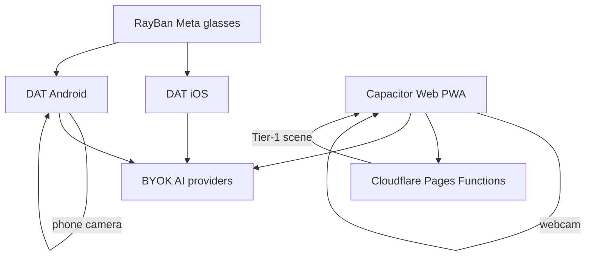

# Two-tier vision architecture

Sightread’s web / Capacitor app uses a **two-tier** vision assistant pipeline.

## Track ownership (DAT vs Capacitor)

Sightread ships **three** client surfaces. Feature work must land on the owning track to avoid drift.

| Track | Path | App ID | Owns |
|-------|------|--------|------|
| **DAT iOS** | [`ios/Sightread`](../ios/Sightread) | `com.meta.wearables.external.Sightread` | Ray-Ban Meta **glasses streaming**, photo capture, Mock Device Kit, glasses-side vision/chat (3 providers today) |
| **DAT Android** | [`android/Sightread`](../android/Sightread) | `com.meta.wearable.dat.externalsampleapps.sightread` | Glasses streaming **plus** Agent-first phone camera, Room chat, 7 providers |
| **Capacitor / Web** | [`web/Sightread`](../web/Sightread) (+ `ios`/`android` shells) | `com.sightread.app` | Phone/browser **Agent + Vision** product: Tier-1 scene JSON, PWA, wake phrase, export, Cloudflare Functions |

**Decision (default):**

- **Glasses path** = DAT native apps (Meta Wearables DAT SDK). Do not add DAT to Capacitor.
- **Phone / browser Agent path** = Capacitor web app. Prefer shipping Agent UX, Tier-1 scene, and PWA features here first.
- **Parity rule:** Android DAT already mirrors Agent-first phone UX; iOS DAT stays glasses-first until Agent tabs / persistence are ported (see [ANDROID_ROADMAP.md](./ANDROID_ROADMAP.md), [PRODUCT_ROADMAP.md](./PRODUCT_ROADMAP.md)).
- **Glasses + Agent together:** use DAT Vision for the glasses feed; use Capacitor Agent on the phone when Tier-1 scene / wake phrase / PWA are required — or port Tier-1 into DAT when glasses frames need the same scene JSON.



## Overview

```
Camera frame
    │
    ▼
Tier 1 — gemini-3.5-flash-lite (async JSON scene extraction)
    │  strict responseSchema → SceneState
    ▼
sceneStore (latest JSON)
    │
    ▼
Tier 2 — conversational model (per turn)
    system prompt = base agent prompt + Current visual scene JSON
    │
    ▼
Reply → accessible TTS (+ optional spatial HRTF cue)
```

Prose vision presets (Vision tab “Analyze now”) remain unchanged and run in parallel with Tier 1.

Default conversational / prose vision model: **`gemini-3.5-flash`** (OpenAI `gpt-4o-mini` / Groq Llama 4 Scout fallbacks).

## Tier 1 — scene extraction

| Item | Detail |
|------|--------|
| Model | `gemini-3.5-flash-lite` |
| Endpoint | `POST /api/vision/scene` (Cloudflare Pages Function) |
| Client | [`src/lib/scene/sceneExtractor.ts`](../web/Sightread/src/lib/scene/sceneExtractor.ts) |
| Schema | [`src/lib/scene/schema.ts`](../web/Sightread/src/lib/scene/schema.ts) |
| Loop | [`src/hooks/useSceneExtraction.ts`](../web/Sightread/src/hooks/useSceneExtraction.ts) |

Scene JSON includes summary, objects (with `azimuthDeg` for spatial audio), text, hazards, people count, environment, and navigation hints.

Requests coalesce: overlapping frames are dropped; manual “Analyze now” aborts and re-runs.

**Native DAT:** Tier-1 is web/Capacitor-only today. Porting to Android/iOS DAT is tracked under [PRODUCT_ROADMAP.md](./PRODUCT_ROADMAP.md).

## Tier 2 — system prompt injection

[`buildAgentSystemPrompt`](../web/Sightread/src/lib/chat/systemPrompt.ts) appends the latest `SceneState` JSON to the agent system prompt on every chat turn. All providers (Gemini system instruction, OpenAI-compatible `system` role, Anthropic `system`) receive the injected context via [`ChatOptions.sceneContext`](../web/Sightread/src/lib/chat/types.ts).

Conversational providers stay multi-provider BYOK; only Tier 1 is pinned to Flash-Lite.

## API keys and rate limiting

| Concern | Behavior |
|---------|----------|
| Preferred key | Pages secret `GEMINI_API_KEY` (never shipped in Capacitor binaries) |
| BYOK fallback | `Authorization: Bearer <gemini-key>` when server secret unset |
| Abuse controls | Same-origin only; **20 req / 60s / IP**; ~1.5 MB body cap |
| Compliance | Function does not log image payloads or API keys |
| Chat keys | On-device: web `localStorage`; Capacitor **Preferences** on native shells; iOS Keychain; Android EncryptedSharedPreferences |

Health: `GET /api/vision/scene` → `{ serverKeyConfigured: boolean }`.

```bash
npx wrangler pages secret put GEMINI_API_KEY --project-name=sightread
```

## Capacitor mobile track

[`web/Sightread`](../web/Sightread) is the Capacitor host (`com.sightread.app`):

```bash
cd web/Sightread
npm run cap:sync      # build + sync ios/android
npm run cap:android
npm run cap:ios
```

Native apps under `ios/Sightread` and `android/Sightread` remain the Meta DAT glasses path and are separate from this Capacitor shell.

## Accessibility audio

| Module | Role |
|--------|------|
| [`src/lib/audio/tts.ts`](../web/Sightread/src/lib/audio/tts.ts) | Capacitor TextToSpeech on device; Web Speech fallback |
| [`src/lib/audio/spatialAudio.ts`](../web/Sightread/src/lib/audio/spatialAudio.ts) | HRTF cue from scene object azimuth before speech |

Enable **Spatial audio cues for TTS** in Settings.
