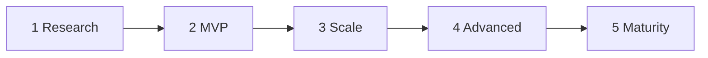

# Product roadmap — AI Vision phases

Maps Sightread to the five-phase AI Vision App roadmap. Platform-specific detail lives in [WEB_ROADMAP.md](./WEB_ROADMAP.md) and [ANDROID_ROADMAP.md](./ANDROID_ROADMAP.md). Track ownership: [ARCHITECTURE_VISION.md](./ARCHITECTURE_VISION.md).

**Current position:** late **MVP** / early **Scale** for web + Android Agent UX; glasses-native iOS is still research/sample maturity.

---

## Phase status

| Phase | Milestone | Status | Notes |
|-------|-----------|--------|-------|
| **#1 Research** | Define Core Vision AI | Partial | Cloud multimodal APIs + web Tier-1 scene JSON |
| | Build Model V1 | Missing | No custom trained weights; third-party APIs only |
| **#2 MVP** | Core App Build | Done | iOS DAT, Android DAT, web/Capacitor |
| | Deploy MVP (iOS/Android) | Partial | Local/dev builds; no store release pipeline |
| | Initial Dataset | Missing | No labeled corpus or eval set in-repo |
| **#3 Scale** | Enhance Model (Speed/Accuracy) | Early | Frame throttling; defaults on Gemini 3.5 Flash / Flash-Lite |
| | User Feedback Loop | Missing | No ratings / corrections → model or prompt updates |
| | Cloud Infrastructure | Partial | Cloudflare Pages Functions only; no auth/sync |
| **#4 Advanced** | Real-Time Tracking | Missing | Scene objects lack persistent IDs across frames |
| | Complex Object Recognition | Schema-only | Scene JSON fields; no specialized detectors |
| | Web Portal Expansion | Companion only | Agent/Vision PWA ≠ ops/analytics dashboard |
| **#5 Maturity** | Market Rollout | Missing | Sample DAT bundle IDs; Capacitor `com.sightread.app` |
| | Edge AI Deployment | Missing | No Core ML / TFLite / MediaPipe on-device path |
| | Strategic Partnerships / Next-Gen | Out of code | Product/BD, not this repo |

---

## Prioritized workstreams

Execute in this order unless a product decision overrides.

### P0 — Foundation hygiene (in progress / continuous)

| Workstream | Owner track | Outcome |
|------------|-------------|---------|
| Docs ↔ code sync | All | Roadmaps reflect shipped vs remaining |
| Model ID audit | All | Defaults match current provider catalogs |
| Minimal CI | Web (+ Android smoke later) | Lint + Vitest on PR |
| DAT SDK 0.9 migration | DAT iOS + Android | `addStream` → `addCamera`; Wi‑Fi transport / Meta Glasses; **breaking** — do not pin-bump without API migration |
| Capacitor Preferences for keys | Web native shells | Prefer Preferences over sync-only localStorage on device |

### P1 — Phase 3 Scale

| Workstream | Description | Suggested start |
|------------|-------------|-----------------|
| **User feedback loop** | In-app thumbs / “correct this” on vision and chat replies; local queue; optional export for prompt/eval tuning | Capacitor Agent + Vision first |
| **Initial dataset + eval harness** | Small labeled frame set + golden SceneState fixtures; CI regression against Tier-1 schema | `web/Sightread` + `docs/datasets/` |
| **Model enhance** | Latency/cost A/B (Flash vs Flash-Lite for prose); interval tuning; optional summarize-older-turns for long chats | Shared model constants |
| **Cloud beyond Pages** | Optional auth + sync only if cross-device history is required; keep BYOK chat keys on-device by default | New backend decision |

### P2 — Phase 4 Advanced

| Workstream | Description | Suggested start |
|------------|-------------|-----------------|
| **Real-time tracking** | Persistent object IDs + simple tracker across Tier-1 frames; feed spatial TTS | Extend `SceneState` schema |
| **Complex recognition** | Specialized prompts or secondary models for text-heavy / product / hazard classes | Tier-1 schema + optional tools |
| **Ops / analytics portal** | Separate dashboard for feedback, eval scores, usage — not the end-user Agent UI | New web app or section |

### P3 — Phase 5 Maturity

| Workstream | Description | Suggested start |
|------------|-------------|-----------------|
| **Edge AI** | On-device detection for offline/low-latency glasses path (Core ML / TFLite) | DAT Android/iOS prototypes |
| **Market rollout** | Production bundle IDs, signing, store listings, privacy nutrition labels | Release engineering |
| **Partnerships / next-gen** | Meta Display glasses UX, OEM integrations | Product |

---

## Near-term engineering backlog (concrete)

Already unfinished in code/docs:

1. Android: wire web-search client into `ChatService`; PDF/Markdown export UI; delete dead `ChatScreen`/`ChatViewModel`; rename `cameraaccess` androidTest package.
2. iOS DAT: Agent-first tabs, conversation persistence, provider parity with Android/web.
3. Web: JSON conversation import; cloud sync (deferred).
4. Port Tier-1 scene extraction to Android DAT (call Pages Function or shared client).
5. DAT **0.9.0** Camera API migration on iOS + Android (blocked on code changes, not a version pin alone).

---

## Dependency notes

| Component | Current | Target / note |
|-----------|---------|---------------|
| Meta DAT | **0.7.0** | **0.9.0** available; requires Camera consolidation migration |
| Gemini chat/vision default | `gemini-3.5-flash` | Tier-1 stays `gemini-3.5-flash-lite` |
| Android `security-crypto` | **1.1.0** | Stable |
| Android Compose BOM | Align with current stable BOM | See `libs.versions.toml` |
| DAT `compileSdk` / `targetSdk` | Align toward **36** with Capacitor | See Android Gradle config |

---

## Related docs

- [ARCHITECTURE_VISION.md](./ARCHITECTURE_VISION.md)
- [WEB_ROADMAP.md](./WEB_ROADMAP.md)
- [ANDROID_ROADMAP.md](./ANDROID_ROADMAP.md)
- [SETUP.md](./SETUP.md)
