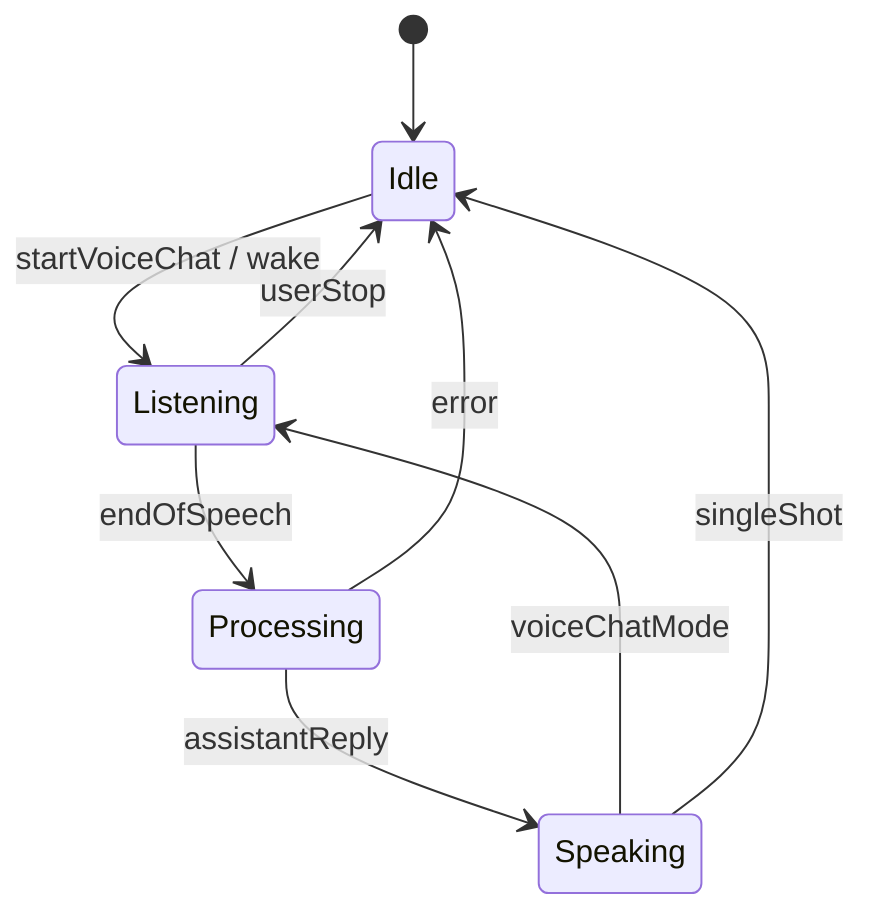

# Web companion roadmap

Plan for evolving `web/Sightread` into a fuller Meta AI–style browser experience. This document covers three upcoming workstreams:

1. **Conversation history persistence**
2. **Always-listening / wake-style voice mode**
3. **Mobile PWA shell**

Current baseline (already shipped on the web branch):

- Agent tab with multi-turn chat, photo attach, mic input, and voice-chat loop
- Vision tab with live webcam analysis
- Settings stored in `localStorage`
- Chat messages live only in React state (lost on refresh)

---

## Guiding principles

- **No backend required for v1** of each feature — stay client-only like the rest of Sightread unless a capability is impossible in-browser.
- **Privacy-first** — conversations and images stay on-device; document what is stored and how to clear it.
- **Progressive enhancement** — features degrade gracefully when IndexedDB, service workers, or speech APIs are unavailable.
- **Reuse mobile concepts** — align naming and UX with iOS/Android where it helps users moving between platforms.

---

## 1. Conversation history persistence

### Goal

Users can close the tab, refresh, or return later and continue prior agent conversations — similar to Meta AI chat history.

### Scope

| In scope (v1) | Out of scope (later) |
|---------------|----------------------|
| Multiple named conversations | Cloud sync across devices |
| Auto-save on each message | Account login |
| Resume last conversation on load | End-to-end encrypted sync |
| Delete conversation / clear all | Full-text search across history |
| Thumbnail storage for sent images | Server-side backup |

### Proposed architecture

```
src/lib/storage/
  types.ts              # StoredConversation, StoredMessage
  conversationStore.ts  # CRUD via IndexedDB
  imageStore.ts         # Blob storage for attachments (optional split)
```

**IndexedDB** (via `idb` or a thin wrapper) is the right default:

- Much larger quota than `localStorage`
- Stores structured data + Blobs for image attachments
- Async API fits React hooks

`localStorage` remains for **Settings** only (API keys, toggles).

### Data model

```ts
interface StoredConversation {
  id: string;
  title: string;           // auto from first user message, editable later
  createdAt: number;
  updatedAt: number;
  provider: AIProvider;    // snapshot at creation time
  messageCount: number;
}

interface StoredMessage {
  id: string;
  conversationId: string;
  role: "user" | "assistant";
  text: string;
  createdAt: number;
  imageId?: string;        // key into image blob store
}

interface StoredImage {
  id: string;
  conversationId: string;
  mimeType: "image/jpeg";
  blob: Blob;
}
```

### UI changes

| Component | Change |
|-----------|--------|
| `App.tsx` | Track `activeConversationId`; pass to agent screen |
| `AgentChatScreen` | Sidebar or sheet: conversation list |
| `AgentChatView` | Load/save via `useConversationPersistence` hook |
| New: `ConversationList.tsx` | New chat, switch, delete |
| New: `useConversationPersistence.ts` | Bridge `useAgentChat` ↔ store |

### Hook integration

Refactor `useAgentChat` to accept optional initial messages and expose `conversationId`. A sibling hook `useConversationPersistence`:

1. On mount — load conversation by id (or create new)
2. On each message append — debounced write to IndexedDB
3. On image send — persist blob, store `imageId` on message
4. On load — recreate `imagePreviewUrl` from stored blobs

### Limits & housekeeping

- Cap stored conversations (e.g. 50) and messages per thread (e.g. 200)
- Cap total image storage (e.g. 100 MB) with LRU eviction
- Settings → **Clear chat history** button
- Migration path: if IndexedDB unavailable, show banner and keep in-memory-only mode

### Implementation phases

| Phase | Deliverable |
|-------|-------------|
| **1a** | `conversationStore` + save/load single thread |
| **1b** | Conversation list UI + new/switch/delete |
| **1c** | Image blob persistence + thumbnails in history |
| **1d** | Title auto-generation, storage limits, clear-all |

### Risks

- **Object URL lifecycle** — must revoke URLs when switching conversations
- **Large histories** — sending 200 messages to Gemini/OpenAI/Groq as one transcript may hit token limits → future: summarize older turns or use native multi-turn APIs per provider

---

## 2. Always-listening / wake-style voice mode

### Goal

Move beyond push-to-talk and manual “Voice chat” toward an ambient mode: the agent listens continuously (or in chunks), detects end-of-speech, responds, and speaks back — closer to talking with Meta AI on glasses.

### Current state

- `useSpeechRecognition` — single utterance (`continuous: false`)
- `useAgentChat` — `voiceConversation` loop: listen → send → `speakAsync` → listen
- Manual **Voice chat** button starts the loop; user must stop explicitly

### Target UX (v2 voice)

| Mode | Behavior |
|------|----------|
| **Push-to-talk** (keep) | Hold mic or tap to record one utterance |
| **Voice chat** (keep, improve) | Auto-restart listening after TTS ends |
| **Always listening** (new) | Optional toggle; listens in segments; VAD or silence timeout triggers send |
| **Wake phrase** (stretch) | “Hey Sightread” — see constraints below |

### Proposed architecture

```
src/hooks/
  useSpeechRecognition.ts     # extend: continuous mode, restart logic
  useVoiceSession.ts          # state machine for voice modes
  useSilenceDetector.ts       # optional Web Audio VAD / energy threshold

src/lib/speech/
  speech.ts                   # TTS (existing)
  voiceSessionTypes.ts        # VoiceMode enum, events
```

### Voice session state machine



### Technical approach

**Phase 2a — Robust continuous voice chat (no wake word)**

1. Set `recognition.continuous = true` when in voice-chat mode
2. Buffer interim results; commit on:
   - `isFinal` result + 800ms silence, or
   - Web Audio analyser RMS below threshold for N ms
3. Ignore mic input while `speakAsync` is running (half-duplex)
4. Auto-restart recognition after TTS `onend` (already partially done)
5. Visual indicator: pulsing ring, “Listening / Thinking / Speaking”

**Phase 2b — Always-listening toggle**

- Settings: **Keep listening between messages**
- Background tab handling: pause listening on `document.hidden`, resume on focus (browser mic policies)
- Battery warning on mobile

**Phase 2c — Wake phrase (optional, hard)**

| Approach | Pros | Cons |
|----------|------|------|
| Browser `continuous` + keyword match on transcript | No extra deps | False positives; drains battery; tab must stay active |
| Porcupine / openWakeWord (WASM) | Real wake word | Bundle size, license, setup complexity |
| Push-to-talk only on mobile | Reliable | Not true wake word |

**Recommendation:** Ship **2a + 2b** first. Treat wake phrase as **Phase 2c** research — document that true always-on wake word in a PWA is limited by OS/browser background mic policies (especially iOS Safari).

### Settings additions

```ts
voiceMode: "off" | "pushToTalk" | "conversation" | "alwaysListening";
silenceTimeoutMs: number;      // default 1200
speakChatReplies: boolean;     // existing
duckAudioWhileSpeaking: boolean;
```

### Implementation phases

| Phase | Deliverable |
|-------|-------------|
| **2a** | `useVoiceSession` state machine + improved continuous STT |
| **2b** | Silence detection + always-listening toggle |
| **2c** | Wake phrase spike (Porcupine WASM or transcript keyword POC) |

### Risks

- **Safari** — intermittent `SpeechRecognition` behavior; test on iOS
- **Echo** — TTS picked up by mic → mute recognition during speak or use headphones prompt
- **Firefox** — limited STT; hide always-listening where unsupported

---

## 3. Mobile PWA shell

### Goal

Make the web app installable and feel native on phones — home-screen icon, fullscreen shell, safe areas, offline shell — comparable to opening Meta AI from the home screen.

### Current gaps

- No `manifest.webmanifest`
- No service worker
- No Apple meta tags (`apple-mobile-web-app-capable`, etc.)
- Bottom nav exists but not tuned for notches / home indicator
- No install prompt UX

### Proposed architecture

```
web/Sightread/
  public/
    manifest.webmanifest
    icons/
      icon-192.png
      icon-512.png
      apple-touch-icon.png
  src/
    sw.ts                    # Vite PWA plugin service worker
    components/
      InstallPrompt.tsx
      OfflineBanner.tsx
```

Use **`vite-plugin-pwa`** (Workbox) for:

- Auto-generated service worker
- Precache JS/CSS/HTML/icons
- `registerType: 'autoUpdate'`

### Manifest sketch

```json
{
  "name": "Sightread",
  "short_name": "Sightread",
  "description": "AI agent and vision companion",
  "start_url": "/",
  "display": "standalone",
  "background_color": "#ffffff",
  "theme_color": "#0064e0",
  "orientation": "portrait-primary",
  "categories": ["productivity", "utilities"],
  "icons": [...]
}
```

### UI / layout polish

| Area | Change |
|------|--------|
| `index.html` | `theme-color`, Apple meta, `viewport-fit=cover` |
| `index.css` | `env(safe-area-inset-*)` on nav and headers (partially done) |
| `AppShell` | Larger touch targets (min 44px), haptic-friendly spacing |
| Agent chat | Sticky composer above keyboard (`visualViewport` API) |
| Vision | Request fullscreen optional on mobile |
| New: `InstallPrompt` | `beforeinstallprompt` banner (Android/desktop Chrome) |
| iOS | “Share → Add to Home Screen” helper modal (no programmatic install) |

### Offline behavior (realistic)

| Works offline | Requires network |
|---------------|------------------|
| Open app shell | AI chat / vision |
| Browse cached conversation list | API calls |
| View previously stored messages/images | New photos / mic streaming |

Service worker caches static assets only in v1 — no offline AI.

### Implementation phases

| Phase | Deliverable |
|-------|-------------|
| **3a** | Manifest + icons + Apple meta tags |
| **3b** | `vite-plugin-pwa` + offline shell |
| **3c** | Install prompt + iOS A2HS instructions |
| **3d** | `visualViewport` keyboard fixes + touch polish |

### Risks

- **iOS PWA limitations** — no push notifications for wake word; background audio restricted
- **Icon assets** — need proper PNGs (export from existing favicon or new brand asset)
- **HTTPS** — required for SW install in production

---

## Suggested execution order

Cross-cutting dependencies:

```
Phase 1 (persistence) ──┐
                        ├──> Phase 3 (PWA) ──> public launch polish
Phase 2 (voice) ────────┘
```

| Order | Workstream | Why |
|-------|------------|-----|
| 1 | **1a–1b** Conversation store + list UI | Highest user-visible value; enables “real” agent app feel |
| 2 | **3a–3b** PWA manifest + service worker | Makes mobile testing realistic for voice work |
| 3 | **2a** Voice session improvements | Builds on PWA mobile shell for device testing |
| 4 | **1c** Image persistence | Depends on store from 1a |
| 5 | **3c–3d** Install UX + keyboard polish | |
| 6 | **2b** Always listening | |
| 7 | **2c** Wake phrase spike | Only after 2a/2b stable |

---

## New dependencies (planned)

| Package | Purpose | Workstream |
|---------|---------|------------|
| `idb` | IndexedDB promise wrapper | 1 |
| `vite-plugin-pwa` | Service worker + manifest injection | 3 |
| `workbox-*` | (transitive) precaching | 3 |
| `@picovoice/porcupine-web` (optional) | Wake word POC | 2c |

No new dependencies required for Phase 2a if we extend existing hooks.

---

## Files likely to change (summary)

```
web/Sightread/
  src/
    hooks/useAgentChat.ts           # persistence callbacks
    hooks/useConversationPersistence.ts  (new)
    hooks/useVoiceSession.ts        (new)
    lib/storage/                    (new)
    components/ConversationList.tsx (new)
    components/InstallPrompt.tsx    (new)
    components/AppShell.tsx         # PWA safe areas
    App.tsx                         # conversation routing
  public/manifest.webmanifest       (new)
  vite.config.ts                    # PWA plugin
docs/WEB_ROADMAP.md                 # this file
```

---

## Success criteria

| Feature | Done when |
|---------|-----------|
| Persistence | Refresh mid-conversation restores messages and images |
| Voice v2 | Hands-free loop runs 10+ turns without manual mic taps |
| PWA | Lighthouse PWA checks pass; installable on Android Chrome + iOS A2HS |

---

## Open questions (for later decisions)

1. **Per-conversation provider** — lock Gemini/OpenAI/Groq at thread creation, or always use current Settings provider?
2. **Export** — allow JSON export of conversations for portability?
3. **Wake word branding** — “Hey Sightread” vs generic “Hey Agent”?
4. **Shared history with mobile** — defer until a backend exists?

---

## Related docs

- [web/Sightread/README.md](../web/Sightread/README.md) — current web setup
- [SETUP.md](SETUP.md) — API keys and glasses setup (mobile)
- [SAMPLE_PROMPTS.md](SAMPLE_PROMPTS.md) — prompt presets shared across platforms
